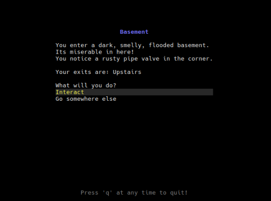

# Text Adventure Game

Welcome to **Text Adventure Game,** a friendly game engine for making interactive text stories, while learning the basics of programming along the way!

With a  plain text file, you can create your own dynamic story driven adventure. Define rooms that change with events, characters to talk to, and conversations that evolve with the story. You can even customize the theme with your own colors, or change the default game text to match your language or style of speech. After you define your game in an `.ini` file, you can run the engine with it, and bring your text adventure game to life!



## 📚 Table of Contents
<details>
  <summary>(Click to see table of contents)</summary>
  <ul>
    <li><a href="#-instructions">🧭 Instructions</a>
      <ul>
        <li><a href="#-detailed-instructions">🧐 Detailed instructions</a></li>
        <li><a href="#️-run-the-game">▶️ Run the game</a></li>
        <li><a href="#-download">📦 Download</a></li>
        <li><a href="#-try-the-demo">🧪 Try the demo</a></li>
      </ul>
    </li>
    <li><a href="#-learn-how-it-was-made">📰 Learn How It Was Made</a></li>
    <li><a href="#-ini-file-structure">📄 INI File Structure</a>
      <ul>
        <li><a href="#multi-line-strings">Multi-line Strings</a></li>
        <li><a href="#root-section-game-title">Root Section: Game Title</a></li>
        <li><a href="#theme-optional">[Theme] (Optional)</a></li>
        <li><a href="#language-optional">[Language] (Optional)</a></li>
      </ul>
    </li>
    <li><a href="#-game-entities">📦 Game Entities</a>
      <ul>
        <li><a href="#naming-conventions">Naming Conventions</a></li>
        <li><a href="#entity-variants">Entity Variants</a></li>
        <li><a href="#room">Room</a></li>
        <li><a href="#character">Character</a></li>
        <li><a href="#dialogue">Dialogue</a></li>
        <li><a href="#response">Response</a></li>
        <li><a href="#item">Item</a></li>
        <li><a href="#action">Action</a>
          <ul>
            <li><a href="#action-types">Action Types</a></li>
            <li><a href="#using-actions-to-create-a-dynamic-story">Using Actions to Create a Dynamic Story</a></li>
          </ul>
        </li>
      </ul>
    </li>
  </ul>
</details>

## 🧭 Instructions

To run the game, first install or download `text-adventure-game`, then create an `.ini` file describing your game world, or use the example file below.

### 🧐 Detailed Instructions
<details>
    <summary>(Click to read detailed instructions)</summary>

#### 🪟 On Windows:

1. [Download the game for Windows](https://github.com/BernardIgiri/text-adventure-game/releases/latest/download/text-adventure-game-x86_64-pc-windows-msvc.zip).
2. Right-click the `.zip` file and select **Extract All...**.
3. [Download `example.ini`](https://raw.githubusercontent.com/BernardIgiri/text-adventure-game/refs/heads/main/example.ini)  
   - Right-click the link → **Save link as...**
4. Move `example.ini` into the folder where you extracted the game.
5. Open the **Start Menu**, type `cmd`, and press **Enter** to open Command Prompt.
6. Navigate to the folder where you extracted the files:
   ```powershell
   cd path\to\your\download\folder
	````

7. Run the game:

   ```powershell
   text-adventure-game.exe -f example.ini
   ```

#### 🍎 On macOS:

1. [Download the game for macOS](https://github.com/BernardIgiri/text-adventure-game/releases/latest/download/text-adventure-game-x86_64-apple-darwin.tar.gz).
2. Open **Finder**, then double-click the `.tar.gz` to extract the app.
3. [Download `example.ini`](https://raw.githubusercontent.com/BernardIgiri/text-adventure-game/refs/heads/main/example.ini)

   * Control-click the link → **Download Linked File As...**
4. Move `example.ini` into the folder with the game binary.
5. Open **Terminal** (use Spotlight with `⌘ + Space`, then type “Terminal”).
6. Navigate to your Downloads folder:

   ```bash
   cd ~/Downloads
   ```
7. macOS blocks running unsigned apps by default. To fix this:

   * Run:

     ```bash
     chmod +x text-adventure-game
     ```
   * Then attempt to run it:

     ```bash
     ./text-adventure-game -f example.ini
     ```
   * If macOS blocks it, go to **System Settings → Privacy & Security**, scroll down, and click **"Allow Anyway"**.
   * Then try running it again.

#### 🐧 On Linux:

1. [Download the game for Linux](https://github.com/BernardIgiri/text-adventure-game/releases/latest/download/text-adventure-game-x86_64-unknown-linux-musl.tar.gz).
2. Extract it using your file manager, or run:

   ```bash
   tar -xzf text-adventure-game-x86_64-unknown-linux-musl.tar.gz
   ```
3. [Download `example.ini`](https://raw.githubusercontent.com/BernardIgiri/text-adventure-game/refs/heads/main/example.ini)

   * Right-click the link → **Save Link As...**
4. Move `example.ini` to the same folder as the extracted binary.
5. Open your terminal and navigate to that folder:

   ```bash
   cd ~/Downloads
   ```
6. Make the game executable:

   ```bash
   chmod +x text-adventure-game
   ```
7. Run the game:

   ```bash
   ./text-adventure-game -f example.ini
   ```
</details>

### ▶️ Run The Game

On **Linux or macOS**, open a terminal and run:

```sh
text-adventure-game -f path/to/your/game.ini
```

On **Windows**, open **Command Prompt** from the Start menu and run:

```powershell
text-adventure-game.exe -f path\to\your\game.ini
```

### 📦 Download

Just download and unzip the file for your OS below.

| Platform | Link |
|----------|------|
| 🐧 Linux (musl) | [Download](https://github.com/BernardIgiri/text-adventure-game/releases/latest/download/text-adventure-game-x86_64-unknown-linux-musl.tar.gz) |
| 🪟 Windows | [Download](https://github.com/BernardIgiri/text-adventure-game/releases/latest/download/text-adventure-game-x86_64-pc-windows-msvc.zip) |
| 🍎 macOS | [Download](https://github.com/BernardIgiri/text-adventure-game/releases/latest/download/text-adventure-game-x86_64-apple-darwin.tar.gz) |

> 🛠️ After downloading, extract the archive. Then double-click the executable or run it from the terminal as shown above.

### 🧪 Try the Demo

Try this [example.ini](https://raw.githubusercontent.com/BernardIgiri/text-adventure-game/refs/heads/main/example.ini) demo game. Right-click the link and choose **“Save Link As…”** to save it.

## 📰 Learn How It Was Made

Read about the development process for this project on [Y = Code!](https://yequalscode.com/posts/making-text-adventure-game)

## 📄 INI File Structure

Every game is defined in a single `.ini` file, a simple, old-school format that's easy to read and edit. This file is divided into sections that describe a part of your game world: the title screen, theme, rooms, characters, and more. You can add comments with semicolons  `;`  to provide context within your file.

### Multi-line Strings

As an enhancement to the `.ini` file format, Text Adventure Game adds support for multi-line strings. Simply wrap your text block in triple quotes `"""` and you can you extend it as far as you like. For example:

```ini
description="""
    A cold wind blows.
    You see your breath.
"""
```

### Root Section: Game Title

The root (unnamed) section must define the following fields:

```ini
title=The Game Title
greeting=Welcome to your next adventure!
credits=Thanks for playing!
start_room=StartingRoom
```

- `title`: Displayed at game launch.
- `greeting`: Displayed when the game begins.
- `credits`: Displayed when the game ends.
- `start_room`: The `Title` id of the room the player begins in.

### [Theme] (Optional)

```ini
[Theme]
title = Red
heading = Green
background = #FF3344
text = #FFFFFF
highlight = RGB(10, 50, 10)
highlight_text = Blue
subdued = Gray
```

Defines colors for the UI. Most valid CSS colors should work, including RGB, hex codes, and common color name strings.

### [Language] (Optional)

Allows you to override built-in strings (e.g., “Talk”, “Do”, “Go”) for localization to different langauges or stylistic changes.

```ini
[Language]
characters_found = You look around and see:
exits_found = You can exit in these directions:
talk = Talk
interact = Interact
go_somewhere = Go someplace?
end_game = End the game?
choose_exit = Get out of here?
cancel_exit = Don't leave
choose_chat = Talk to:
cancel_chat = Nevermind
choose_response = You say:
cancel_response = ...
choose_action = You decide to:
cancel_action = Nevermind
action_failed = That didn't work
continue_game = Keep Going?
press_q_to_quit = The letter q is for quit!
```

------

## 📦 Game Entities

Each entity section starts with one of the following headers:

- `[Room:RoomName]`
- `[Room:RoomName|variant]` (see **Variants** below)
- `[Character:CharacterName]`
- `[Dialogue:dialogue_id]`
- `[Dialogue:dialogue_id|variant]` (see **Variants** below)
- `[Response:response_id]`
- `[Item:item_id]`
- `[Action:action_id]`

### Naming Conventions

| Type         | Syntax     | Example        |
| ------------ | ---------- | -------------- |
| `Title`      | CamelCase  | `StartingRoom` |
| `Identifier` | snake_case | `the_ring`     |

The engine will prettify names when shown to players:

- `StartingRoom` → **Starting Room**
- `the_ring` → **The Ring**

Only rooms and character names use `Title` syntax. Everything else is an `Identifier`.

### Entity Variants

Some entities can have variants to reflect dynamic changes (e.g., after an event):

```ini
[Room:Basement|rubble]
description=The basement is filled with rubble.
```

The default variant is the one with no `|variant` suffix. All entities that have variants must include a default. Variants use `Identifier` syntax.

------

### Room

Each room must define:

```ini
[Room:Basement]
description=A cold, damp basement.
exits=north:LivingRoom,east:SecretLab
characters=CuriousCalvin
actions=open_crate
```

- `description`: Text shown when entering the room.
- `exits`: (Optional) Comma-separated list of directions and destinations. Each direction is separated from the destination room name by a colon `:`.
- `characters`: (Optional) Comma-separated list of characters present.
- `actions`: (Optional) Comma-separated list of actions available.

**If a room has no exits, the game ends when the player enters it!**

### Character

```ini
[Character:NeighborFrank]
start_dialogue=hello
```

- `start_dialogue`: The ID of the dialogue shown when the player talks to this character.

------

### Dialogue

```ini
[Dialogue:hello]
text=Hi there!
responses=wave,goodbye
```

Dialogues show text and present a list of responses. They can have **variants** to show different text based on game state.

- `text`: Text spoken by the character.
- `responses`: (Optional) Comma-separated list of response IDs. If omitted, the chat ends immediately.

```ini
[Dialogue:hello|rude]
text=Go away!
responses=shrug
requires=has_item:the_ring
```

### Requirements

Use the optional `requires` attribute to conditionally show dialogue variants. Supported conditions:

- `has_item:item_id`
- `room_variant:RoomName|variant`

If no requirements match, the default variant (no `|variant`) is shown.

------

### Response

```ini
[Response:wave]
text=You wave back.
leads_to=goodbye
```

- `text`: This text appears as a selectable menu option.
- `leads_to`: (Optional) The next dialogue ID. If not specified, the chat ends.

`requires` works the same way as for dialogue, but responses **do not** have variants.

------

### Item

```ini
[Item:the_ring]
description=A mysterious golden ring.
```

Items can be given to or taken from the player via actions.

------

### Action

Actions are powerful tools for changing the state of your game. They can move the player, give or take items, swap things out, or even end the game. All by modifying other entities in response to what the player does.

Here are some example actions:

```ini
[Action:pull_lever]
change_room=WoodShed->closed
description=You pull the hefty lever and hear a satisfying clunk! Immediately, the lights go out, and the lever seizes in place.

[Action:pay_bribe]
take_item=silver_coin
description=You give away your last coin begrudgingly.

[Action:unlock_chest]
replace_item=key->ring
description=You unlock the chest and discover a golden ring!

[Action:pickup_key]
give_item=key
description=You pick up the dingy key on the floor.

[Action:beam_me_up]
teleport_to=Enterprise
required=silver_coin
description=Scotty teleports you aboard the ship!

[Action:push_the_red_button]
sequence=pickup_key,unlock_chest,beam_me_up
required=golden_ticket
description=You don't quite know what just happened, but you are now on a spaceship with a ring in your hand!
```

#### Action Types

You can define several types of actions:

- `ChangeRoom`: Updates the to a specified variant.
- `GiveItem`: Adds items to the player's inventory.
- `TakeItem`: Removes items from the player's inventory.
- `ReplaceItem`: Swaps one item for another.
- `Teleport`: Instantly moves the player to a different room.
- `Sequence`: Chains together multiple actions in order.

The actions `Teleport`, `Sequence`, and `ChangeRoom` include an optional `required` field. If specified, the required item must be in the player's inventory to perform the action. Additionally, when that action is completed, that item is then removed from the player's inventory.

#### Using Actions To Create A Dynamic Story

Actions make your game feel alive. For example, suppose an event requires that characters move between rooms. You can combine a `ChangeRoom` and a `Sequence` to update multiple rooms at once, switching them to a variant where those characters are in new locations.

Furthermore, if you need to trigger a conversation, a single `GiveItem` action can do . Since dialogues and responses are switched by room variants and items in the players inventory, giving the player an item can open up new dialogue options. Additionally, if you want to end the game at any point, can use the `Teleport` action to send the player to a room with no exits, as that ends the game.

Actions aren’t just mechanics, they are key to telling a dynamic story.
